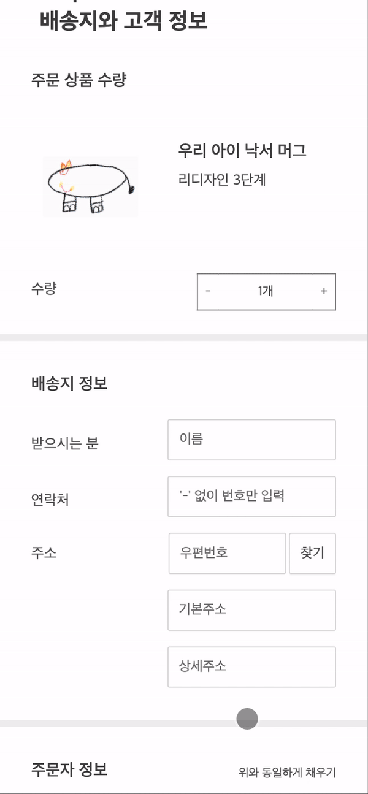

<!-- @format -->

## ✏️아이의 상상을 현실로, Doodle🖍

### Doodle은 아이의 낙서를 디자이너가 리디자인하여 이용자 맞춤 굿즈로 제작하는 아이 낙서 리디자인 굿즈 제작 서비스입니다.

## 제품 예시

### 모두 실제 아이의 낙서로 제작된 제품입니다.

- 핸드폰 케이스부터 시작해 패브릭류, 식기류 등 다양한 품목으로 사업 확장 중

## 팀 활동 소개

- 개발자 2명, 디자이너 2명, 기획자 1명으로 구성된 자체 개발이 가능한 팀, 두들

- 활동 시작일: 2020.3 (신촌 IT 연합동아리 CEOS 11기) ~ ing

- Doodle 인스타그램: [@mydoodle.official](https://www.instagram.com/mydoodle.official/)

## 웹 사이트 UI

### 메인 화면

- 사이트 상단에 캐러솔이 있고, 아래 상세 페이지를 볼 수 있다.
- 사이트 하단에 고정되어있는 주문하러가기 버튼으로 주문화면으로 넘어갈 수 있다.

### Step1

- 낙서 이미지를 업로드하고 업로드한 이미지를 미리 볼 수 있다.
- 이미지를 잘못 선택했을 경우 재선택이 가능하도록 설계했다.

### Step2

- 낙서 리디자인 단계를 리디자인 예시와 함꼐 보며 선택할 수 있다.

### Step3

- 주문 수량을 선택하고, 수량에 따라 최종 결제 금액이 계산된다.
- daum 배송지 입력 api를 이용해 사용자가 편리하게 배송지를 입력할 수 있다.
- 주문 정보가 완벽히 채워지지 않았을 경우 경고 메세지와 함께 화면이 넘어가지 않도록 설계했다.

### Mypage

#### 메인 화면

- 맨 위에 이름과 전화번호를 입력하여 주문을 조회할 수 있다.
- 주문 조회 아래 부분에 자주 묻는 질문들을 모아놓았다.
- 카카오톡 플러스친구 바로가기 버튼을 통해 두들 카카오톡 플러스친구 메인으로 넘어갈 수 있다.

- 주문자 명과 연락처를 이용해 지난 주문을 체크할 수 있다.
- 최근 주문 순으로 정렬되도록 `map.filter`를 써서 구현하였다.

## 웹 사이트 링크

https://doodle.ceos.vercel.app

위 링크로 페이지에 바로 접속하실 수 있습니다.

## 사용 기술

- 언어 `javascript`
- 프론트엔드 프레임워크 `React.js` 사용
- 서버사이드 랜더링 `Next.js` 사용
- 서버 통신 `axios` 이용
